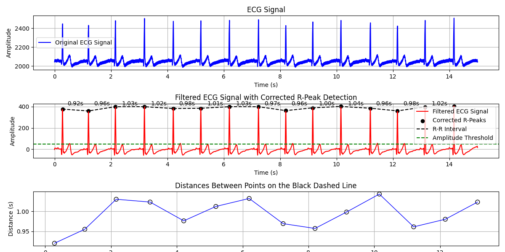
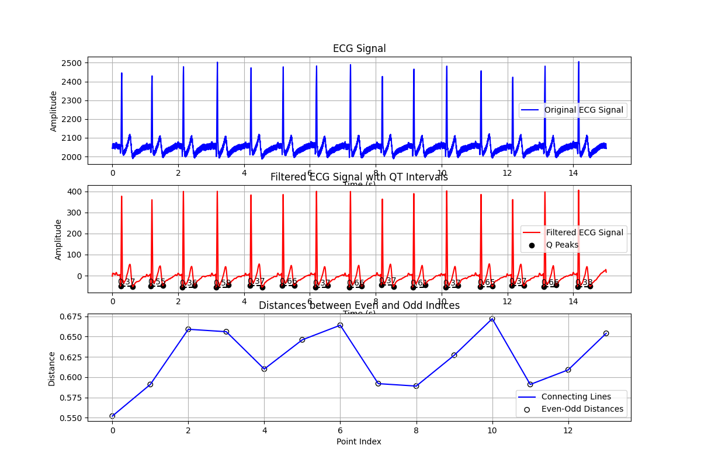
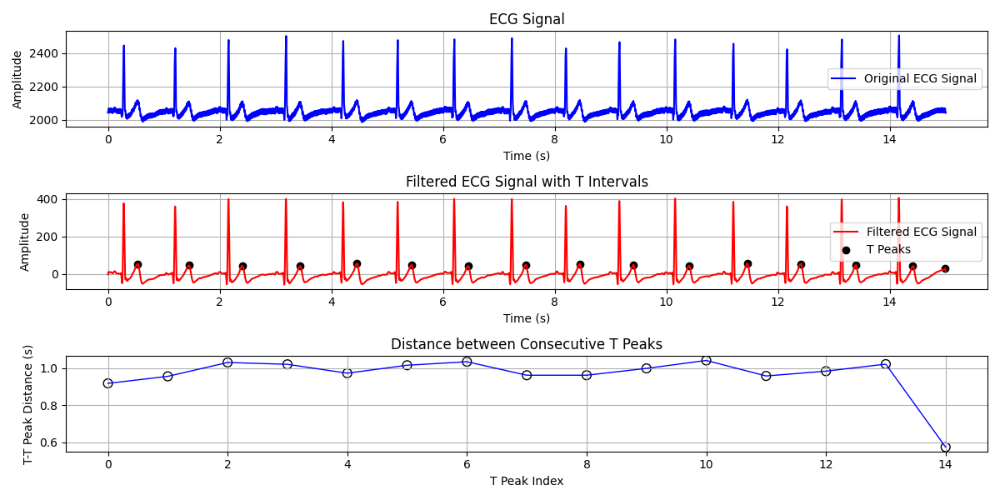

# QRS Complex Detection in ECG signals
In this project, we detect the time domain parameters of the ECG signals, such as QRS complex, R-R and Q-T intervals and T peaks.

## Dataset
I useed two simple datasets that you can find it <code>Dataset</code> here.

You can use any other datasets. **You only need to note that the recorded signal is saved in a <code>.txt</code> file**

## How to work?
After cloned this repository, run the <code>ECG_TimeDomain_Parameter.py</code>.

After running <code>ECG_TimeDomain_Parameter.py</code>, you will see the following menu:

All the data files in the dataset folder will be displayed to you, and you have to choose one of them.  And in the next step, you have to choose one of the methods in the ECG signal.

wait for response 😃

## Result
result of RR interval:

result of Q-T interval:

result of T peak:

## License
This project is licensed under the [MIT License](LICENSE).
